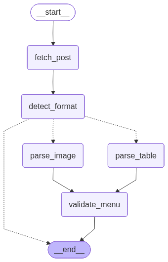

# 운정교내식당 메뉴 알림 서비스

성신여대 운정교내식당 메뉴를 크롤링하여 웹으로 제공하고, 카카오톡 공유 시 OG 이미지 미리보기를 지원하는 서비스입니다.

## 기능

- 오늘의 메뉴 조회 (자동 크롤링)
- 주간 메뉴 보기 (`/weekly`)
- 카카오톡 공유용 OG 이미지 자동 생성 (`/og-image/<date>.png`)
- 날짜별 메뉴 캐싱
- **HTML 테이블 / 이미지 게시물 자동 감지** — 이미지 형식은 Gemini Vision OCR로 파싱

## 크롤링 아키텍처 (LangGraph)

게시물 형식(HTML 테이블 vs 이미지)에 따라 파싱 경로를 자동으로 분기합니다.



```
            ┌─────────────────────────┐
            │      입력: post_url      │
            └────────────┬────────────┘
                         │
                         ▼
            ┌─────────────────────────┐
            │       fetch_post        │  HTTP GET → html
            └────────────┬────────────┘
                         │
                         ▼
            ┌─────────────────────────┐
            │      detect_format      │  artclView 파싱
            └────────────┬────────────┘
                         │
            ┌────────────┴────────────┐
            │ (조건 분기)              │
            ▼                         ▼
┌─────────────────┐       ┌─────────────────────┐
│   parse_table   │       │    parse_image       │
│  HTML 테이블    │       │  Gemini Vision OCR   │
│  파싱           │       │  (gemini-2.5-flash)  │
└────────┬────────┘       └──────────┬──────────┘
         │                           │
         └──────────┬────────────────┘
                    │
                    ▼
       ┌────────────────────────┐
       │      validate_menu     │  검증 항목:
       │                        │  · post_url HTTP 200 확인
       │                        │  · menu_dict 비어있지 않은지
       │                        │  · 날짜가 평일(월~금)인지
       │                        │  · 오늘 기준 ±14일 이내인지
       │                        │  · 날짜당 메뉴 3개 이상인지
       └────────────┬───────────┘
                    │
                    ▼
       ┌────────────────────────┐
       │  {date: [items]} 반환  │
       └────────────────────────┘
```

## 서비스 URL

| URL | 설명 |
|-----|------|
| `/` | 오늘 메뉴 |
| `/?d=YYYY-MM-DD` | 특정 날짜 메뉴 |
| `/weekly` | 이번 주 메뉴 전체 |
| `/og-image/YYYY-MM-DD.png` | 카카오톡 공유용 OG 이미지 |

### 예시

```
# 오늘 메뉴
https://wjmenu.repia.com/

# 특정 날짜 메뉴 (2026년 3월 9일)
https://wjmenu.repia.com/?d=2026-03-09

# 이번 주 메뉴
https://wjmenu.repia.com/weekly

# OG 이미지 (PNG)
https://wjmenu.repia.com/og-image/2026-03-09.png
```

> 로컬에서는 `http://localhost:5005` 로 치환해서 사용합니다.

## 로컬 실행

```bash
# 의존성 설치
uv sync

# 환경 변수 설정
cp .env.example .env
# GEMINI_API_KEY 발급 후 .env에 입력 (이미지 형식 게시물 파싱 필요)

# 폰트 다운로드 (최초 1회)
uv run python scripts/download_fonts.py

# 서버 실행
uv run python app.py
# http://localhost:5005/
```

## 환경 변수 (.env)

| 변수 | 설명 | 기본값 |
|------|------|--------|
| `FLASK_HOST` | 바인딩 호스트 | `0.0.0.0` |
| `FLASK_PORT` | 포트 | `5005` |
| `FLASK_DEBUG` | 디버그 모드 | `false` |
| `BASE_URL` | OG 이미지 절대 URL 생성용. **운영 서버는 반드시 명시** | 요청 호스트 자동 감지 |
| `TARGET_URL` | 크롤링 대상 URL | 성신여대 공지 페이지 |
| `CAFETERIA_KEYWORD` | 식당 필터 키워드 | `운정교내식당` |
| `GEMINI_API_KEY` | Gemini Vision API 키 (이미지 메뉴표 OCR용) | — |

> 운영 서버에서는 `BASE_URL=https://wjmenu.repia.com` 으로 설정해야 OG 이미지가 올바르게 동작합니다.

## Docker 배포

```bash
cd docker
docker compose up -d --build
```

### 운영 서버 최초 설정

폰트 파일은 gitignore 대상이므로 서버에서 직접 다운로드해야 합니다:

```bash
mkdir -p static/fonts && cd static/fonts
curl -L -o NanumGothic.ttf \
  "https://github.com/google/fonts/raw/main/ofl/nanumgothic/NanumGothic-Regular.ttf"
curl -L -o NanumGothicBold.ttf \
  "https://github.com/google/fonts/raw/main/ofl/nanumgothic/NanumGothic-Bold.ttf"
```

> `docker-compose.yml`이 `static/fonts/`를 볼륨 마운트하므로, 폰트가 없으면 이미지 텍스트가 깨집니다.

## 프로젝트 구조

```
app.py              # Flask 라우트
crawler.py          # 메뉴 크롤링 (requests + BeautifulSoup)
crawler_graph.py    # LangGraph 크롤링 그래프 (테이블/이미지 분기 + 검증)
cache.py            # 날짜별 JSON/PNG 파일 캐시 + post_url 캐시
og_image.py         # Pillow OG 이미지 생성 (1200×630px)
notifier.py         # 오류 알림
scripts/
  download_fonts.py  # NanumGothic 폰트 다운로드
docker/
  Dockerfile
  docker-compose.yml
```
